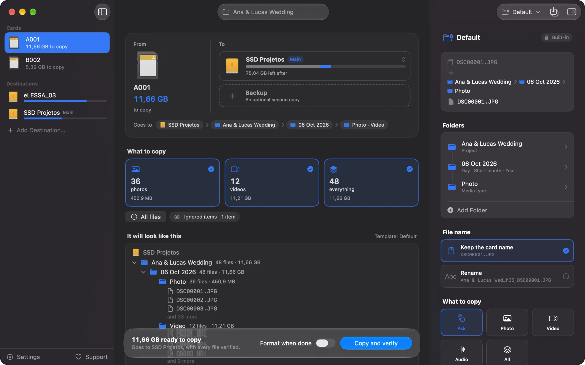

[Português](README.md) · **English** · [Español](README.es.md)

# Cardflow

Copy your camera cards without the fear of losing a single take.

[Download for Mac](https://github.com/grlessa/cardflow/releases/latest/download/Cardflow.dmg) · [Website](https://cardflow.lessafilms.com) · [Support](https://cardflow.lessafilms.com/apoie/)



You plug in the card and the drive where you want to keep it. Cardflow copies everything, checks
file by file, and only lets you format the card once it's sure every photo and every video arrived
intact. If you want, it copies to two places at once: a drive and a backup.

I built it for people who shoot church services, events, concerts or weddings and need to clear a
card safely, without dragging folders by hand and praying nothing gets corrupted along the way.

## What it does

- Shows where each file goes before copying: the drive, how much space is left afterwards and the
  exact folder.
- Copies to one drive and, if you want, to a backup at the same time.
- After copying, it verifies every file. If one doesn't match, it warns you in red so you don't
  format the card.
- When everything checks out, it gives you the green light, and you can format the card right
  there, to the official SD standard.
- Organizes the folders however you choose: date, project, camera, card or media type. You see the
  real name of each folder while you pick.
- Recognizes the camera from the file itself (FX30, A7S III, R5…). If the card has several cameras,
  each file gets its own camera's name, and you can leave one of them on the card.
- Writes a simple report into each project folder that you can send to the client.
- If you run it again on the same card, it skips what's already copied instead of duplicating.
- Copies cinema formats (RED, Blackmagic, Sony, ARRI) without touching the folder structure those
  cameras need.
- Works in Portuguese, English and Spanish.

## Install

1. Download [Cardflow.dmg](https://github.com/grlessa/cardflow/releases/latest/download/Cardflow.dmg).
2. Open the file and drag Cardflow into your Applications folder.
3. The first time you read a card, the Mac asks once whether the app can access the drives. Click
   Allow. It won't ask again for every card.

Requires macOS 26 or later. The app is signed and notarized by Apple, so it opens normally, without
that "unidentified developer" warning.

## How to use

1. Connect the card and the drive where you want to save.
2. Check the destination and choose what to copy: photos, videos, audio or everything.
3. Click Copy and verify.
4. When the green light shows up, you can format the card safely.

## Updates

When you open the app, it checks whether a new version is out. If there is one, a small notice
appears, and one click downloads it, installs it and reopens Cardflow.

## Privacy

Cardflow works offline. The only time it uses the internet is for that check for a new version.
Your files never leave your computer, and there's no sign-up or tracking of any kind.

## Support

Cardflow is free. If it saves you work, you can support it on the
[support page](https://cardflow.lessafilms.com/apoie/). Starring the repo and reporting what went
wrong in the [issues](../../issues) helps too.

## For those who want the technical details

A native macOS app built in Swift and SwiftUI. The engine (`OffloadKit`) is pure Swift with no
external dependencies; the app uses Sparkle only for updates.

### How verification works

It's not a plain copy and paste. For each file, Cardflow computes an xxHash64 hash of the source and
of what was written to each destination, and only marks it as verified when the two match. Before
comparing, it forces an fsync to make sure the bytes left the cache and actually reached the disk. If
verification fails, the corrupted file is deleted and the interface holds back the green light. The
card never shows up as safe without that proof.

Other guarantees from the engine:

- It doesn't overwrite. Running it again skips what's already there (same hash) and separates files
  with the same name but different content instead of clobbering them.
- It preserves cinema. RED (.RDM/.RDC/.R3D), BRAW (.braw plus its auxiliary file), P2 and XAVC are
  copied as they are, keeping the folder tree. Flattening would break the relink in the editor.
- It refuses a copy and a backup that are the same physical disk (checked via DiskArbitration),
  because that wouldn't be a real backup.
- It won't format while any media file on the card hasn't been copied and verified, including files
  from a camera you chose to leave out.
- Each card produces a manifest with a record of what was copied: source, destination and hash.

### How the project is organized

- `Sources/OffloadKit` is the engine, in pure Swift, with no interface: reading the card, copying,
  verification, names from templates, manifest, report and template memory.
- `Sources/CardFormatKit` and the format helper take care of formatting the card to the SD standard.
- `Sources/CardflowApp` is the SwiftUI interface.
- `Sources/cardflow` and `Sources/CardflowCLI` are the command-line version, which uses the same
  engine.

### Building from source

You need Swift 6.2 (Xcode 26) on macOS 26.

```sh
swift build
swift run cardflow --help
bash scripts/make-app.sh
```

To build the signed version packaged in a DMG, see [`docs/notarizacao.md`](docs/notarizacao.md) and
the scripts in `scripts/`.

## License

[MIT](LICENSE). Use, modify and distribute freely, just keep the copyright notice.
