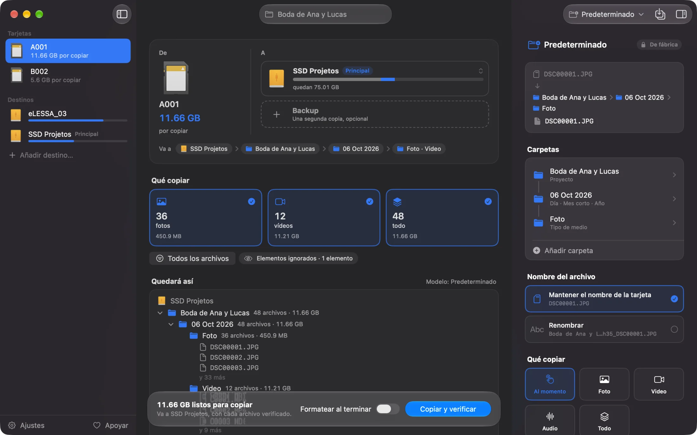

[Português](README.md) · [English](README.en.md) · **Español**

# Cardflow

Copia tus tarjetas de cámara sin miedo a perder una sola toma.

[Descargar para Mac](https://github.com/grlessa/cardflow/releases/latest/download/Cardflow.dmg) · [Sitio](https://cardflow.lessafilms.com) · [Apoyar](https://cardflow.lessafilms.com/apoie/)



Conectas la tarjeta y el disco donde quieres guardarla. Cardflow copia todo, verifica archivo por
archivo y solo te deja formatear la tarjeta cuando tiene la certeza de que cada foto y cada video
llegó intacto. Si quieres, copia a dos lugares a la vez: un disco y un backup.

Lo hice para quien graba cultos, eventos, conciertos o bodas y necesita vaciar la tarjeta con
seguridad, sin andar arrastrando carpetas a mano y rezando para que nada se corrompa en el camino.

## Qué hace

- Muestra adónde va cada archivo antes de copiar: el disco, cuánto espacio queda después y la
  carpeta exacta.
- Copia a un disco y, si quieres, a un backup al mismo tiempo.
- Después de copiar, verifica cada archivo. Si alguno no coincide, te avisa en rojo para que no
  formatees la tarjeta.
- Cuando todo está bien, te da la luz verde, y puedes formatear la tarjeta ahí mismo, en el
  estándar oficial de SD.
- Organiza las carpetas como elijas: fecha, proyecto, cámara, tarjeta o tipo de medio. Ves el
  nombre real de cada carpeta mientras eliges.
- Reconoce la cámara por el propio archivo (FX30, A7S III, R5…). Si la tarjeta tiene varias
  cámaras, cada archivo sale con el nombre de la suya, y puedes dejar una de ellas en la tarjeta.
- Genera un informe simple en cada carpeta de proyecto, que puedes enviar al cliente.
- Si lo vuelves a usar con la misma tarjeta, se salta lo que ya copió en vez de duplicarlo.
- Copia formatos de cine (RED, Blackmagic, Sony, ARRI) sin tocar la estructura de carpetas que
  esas cámaras necesitan.
- Funciona en portugués, inglés y español.

## Instalar

1. Descarga [Cardflow.dmg](https://github.com/grlessa/cardflow/releases/latest/download/Cardflow.dmg).
2. Abre el archivo y arrastra Cardflow a la carpeta Aplicaciones.
3. La primera vez que leas una tarjeta, el Mac pregunta una vez si la app puede acceder a los
   discos. Haz clic en Permitir. No vuelve a preguntar con cada tarjeta.

Requiere macOS 26 o posterior. La app está firmada y notarizada por Apple, así que abre normal, sin
ese aviso de "desarrollador no identificado".

## Cómo usarlo

1. Conecta la tarjeta y el disco donde quieres guardar.
2. Revisa el destino y elige qué copiar: fotos, videos, audio o todo.
3. Haz clic en Copiar y verificar.
4. Cuando aparezca el verde, puedes formatear la tarjeta con seguridad.

## Actualizaciones

Cuando abres la app, revisa si salió una versión nueva. Si salió, aparece un aviso pequeño, y un
clic la descarga, la instala y vuelve a abrir Cardflow.

## Privacidad

Cardflow funciona sin conexión. La única vez que usa internet es para esa revisión de versión
nueva. Tus archivos nunca salen de tu computadora, y no hay registro ni rastreo de ningún tipo.

## Apoyar

Cardflow es gratis. Si te ahorra trabajo, puedes apoyarlo en la
[página de apoyo](https://cardflow.lessafilms.com/apoie/). Darle una estrella al repositorio y
contar qué salió mal en los [issues](../../issues) también ayuda.

## Para quien quiere los detalles técnicos

App nativa de macOS hecha en Swift y SwiftUI. El motor (`OffloadKit`) es Swift puro y sin
dependencias externas; la app usa Sparkle solo para las actualizaciones.

### Cómo funciona la verificación

No es un copiar y pegar común. Para cada archivo, Cardflow calcula un hash xxHash64 del origen y de
lo que se grabó en cada destino, y solo lo marca como verificado cuando los dos coinciden. Antes de
comparar, fuerza un fsync para asegurarse de que los bytes salieron de la caché y llegaron de verdad
al disco. Si la verificación falla, el archivo corrupto se borra y la interfaz retiene la luz verde.
La tarjeta nunca aparece como segura sin esa prueba.

Otras garantías del motor:

- No sobrescribe. Volver a ejecutarlo se salta lo que ya está (mismo hash) y separa archivos con el
  mismo nombre pero contenido distinto en vez de pisarlos.
- Preserva el cine. RED (.RDM/.RDC/.R3D), BRAW (.braw más su archivo auxiliar), P2 y XAVC se copian
  tal cual, manteniendo el árbol de carpetas. Aplanarlo rompería el relink en el editor.
- Rechaza una copia y un backup que sean el mismo disco físico (lo comprueba vía DiskArbitration),
  porque eso no sería un backup de verdad.
- No deja formatear mientras quede en la tarjeta algún archivo de medio sin copiar y verificar,
  incluso de una cámara que elegiste dejar fuera.
- Cada tarjeta genera un manifiesto con el registro de lo que se copió: origen, destino y hash.

### Cómo está organizado el proyecto

- `Sources/OffloadKit` es el motor, en Swift puro, sin interfaz: lectura de la tarjeta, copia,
  verificación, nombres por plantilla, manifiesto, informe y memoria de modelos.
- `Sources/CardFormatKit` y el ayudante de formateo se encargan de formatear la tarjeta en el
  estándar SD.
- `Sources/CardflowApp` es la interfaz en SwiftUI.
- `Sources/cardflow` y `Sources/CardflowCLI` son la versión de línea de comandos, que usa el mismo
  motor.

### Compilar desde el código

Necesitas Swift 6.2 (Xcode 26) en macOS 26.

```sh
swift build
swift run cardflow --help
bash scripts/make-app.sh
```

Para generar la versión firmada y empaquetada en DMG, mira [`docs/notarizacao.md`](docs/notarizacao.md)
y los scripts en `scripts/`.

## Licencia

[MIT](LICENSE). Úsalo, modifícalo y distribúyelo libremente, solo mantén el aviso de copyright.
