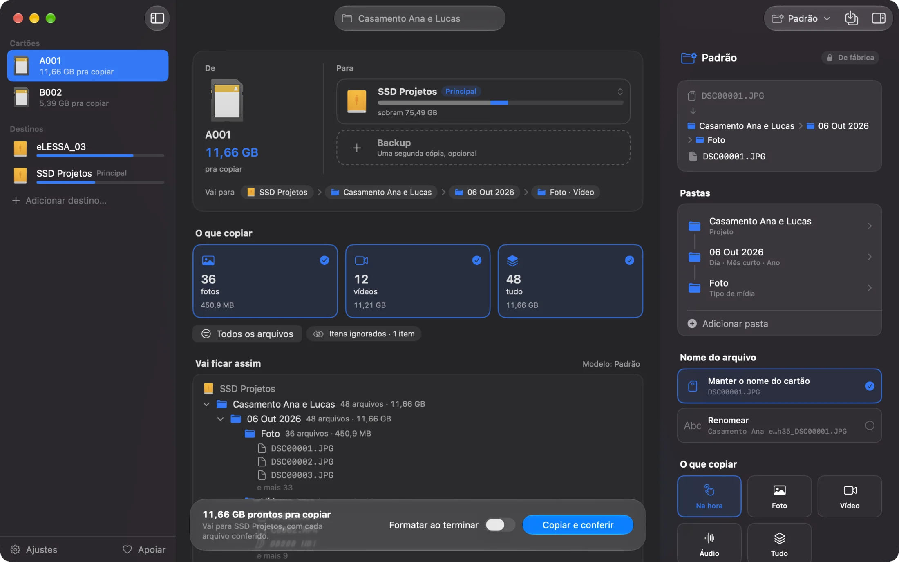

**Português** · [English](README.en.md) · [Español](README.es.md)

# Cardflow

Copie seus cartões de câmera sem medo de perder gravação.

[Baixar para Mac](https://github.com/grlessa/cardflow/releases/latest/download/Cardflow.dmg) · [Site](https://cardflow.lessafilms.com) · [Apoie](https://cardflow.lessafilms.com/apoie/)



Você conecta o cartão e o disco onde quer guardar. O Cardflow copia tudo, confere arquivo por
arquivo e só libera a formatação quando tem certeza de que cada foto e cada vídeo chegou inteiro.
Se quiser, copia pra dois lugares de uma vez, um disco e um backup.

Fiz pra quem grava culto, evento, show ou casamento e precisa esvaziar o cartão com segurança,
sem ficar arrastando pasta na mão e rezando pra nada corromper no caminho.

## O que ele faz

- Mostra pra onde vai cada arquivo antes de copiar: o disco, quanto espaço sobra depois e a pasta
  exata.
- Copia pra um disco e, se você quiser, pra um backup ao mesmo tempo.
- Depois de copiar, confere cada arquivo. Se algum não bateu, avisa em vermelho pra você não
  formatar o cartão.
- Quando está tudo certo, dá o sinal verde, e dá pra formatar o cartão ali mesmo, no padrão
  oficial do SD.
- Organiza as pastas do jeito que você escolher: data, projeto, câmera, cartão ou tipo de mídia.
  Você vê o nome real de cada pasta enquanto escolhe.
- Reconhece a câmera pelo próprio arquivo (FX30, A7S III, R5…). Se o cartão tiver várias câmeras,
  cada arquivo sai com o nome da sua, e você pode deixar uma delas no cartão.
- Gera um relatório simples em cada pasta de projeto, que dá pra mandar pro cliente.
- Se você rodar de novo no mesmo cartão, ele pula o que já copiou em vez de duplicar.
- Copia formatos de cinema (RED, Blackmagic, Sony, ARRI) sem mexer na estrutura de pastas que
  essas câmeras precisam.
- Funciona em português, inglês e espanhol.

## Instalar

1. Baixe o [Cardflow.dmg](https://github.com/grlessa/cardflow/releases/latest/download/Cardflow.dmg).
2. Abra o arquivo e arraste o Cardflow pra pasta Aplicativos.
3. Na primeira vez que você ler um cartão, o Mac pergunta uma vez se o app pode acessar os
   discos. Clique em Permitir. Ele não pergunta de novo a cada cartão.

Precisa do macOS 26 ou mais novo. O app é assinado e notarizado pela Apple, então abre normal,
sem aquele aviso de "desenvolvedor desconhecido".

## Como usar

1. Conecte o cartão e o disco onde quer salvar.
2. Confira o destino e escolha o que copiar: fotos, vídeos, áudio ou tudo.
3. Clique em Copiar e conferir.
4. Quando aparecer o verde, pode formatar o cartão com segurança.

## Atualizações

Quando você abre o app, ele olha se saiu versão nova. Se saiu, aparece um aviso pequeno, e um
clique baixa, instala e reabre o Cardflow.

## Privacidade

O Cardflow trabalha offline. A única vez que ele usa a internet é nessa olhada pra ver se tem
versão nova. Seus arquivos nunca saem do seu computador, e não tem cadastro nem rastreamento de
nenhum tipo.

## Apoie

O Cardflow é gratuito. Se ele te poupa trabalho, dá pra apoiar pela
[página de apoio](https://cardflow.lessafilms.com/apoie/). Dar uma estrela aqui no GitHub e
contar o que deu errado nas [issues](../../issues) também ajuda.

## Pra quem quer os detalhes técnicos

App nativo de macOS feito em Swift e SwiftUI. O motor (`OffloadKit`) é Swift puro e sem
dependências externas; o app usa Sparkle só para a atualização.

### Como a conferência funciona

Não é um copiar e colar comum. Pra cada arquivo, o Cardflow calcula um hash xxHash64 da origem e
do que foi gravado em cada destino, e só marca como conferido quando os dois batem. Antes de
comparar, força um fsync pra garantir que os bytes saíram do cache e foram mesmo pro disco. Se a
conferência falha, o arquivo corrompido é apagado e a interface segura o sinal verde. O cartão
nunca aparece como seguro sem essa prova.

Outras garantias do motor:

- Não sobrescreve. Rodar de novo pula o que já está lá (mesmo hash) e separa arquivos de mesmo
  nome com conteúdo diferente em vez de passar por cima.
- Preserva cinema. RED (.RDM/.RDC/.R3D), BRAW (.braw mais o arquivo auxiliar), P2 e XAVC são
  copiados como estão, mantendo a árvore de pastas. Achatar quebraria o relink no editor.
- Recusa cópia e backup que sejam o mesmo disco físico (checa via DiskArbitration), porque isso
  não seria backup de verdade.
- Não deixa formatar enquanto houver arquivo de mídia no cartão que não foi copiado e conferido,
  inclusive de uma câmera que você escolheu deixar de fora.
- Cada cartão gera um manifesto com o registro do que foi copiado: origem, destino e hash.

### Como o projeto está organizado

- `Sources/OffloadKit` é o motor, em Swift puro, sem interface: leitura do cartão, cópia,
  conferência, nomes por template, manifesto, relatório e memória de modelos.
- `Sources/CardFormatKit` e o ajudante de formatação cuidam de formatar o cartão no padrão SD.
- `Sources/CardflowApp` é a interface em SwiftUI.
- `Sources/cardflow` e `Sources/CardflowCLI` são a versão de linha de comando, que usa o mesmo
  motor.

### Compilar do código

Precisa do Swift 6.2 (Xcode 26) no macOS 26.

```sh
swift build
swift run cardflow --help
bash scripts/make-app.sh
```

Pra gerar a versão assinada e empacotada em DMG, veja [`docs/notarizacao.md`](docs/notarizacao.md)
e os scripts em `scripts/`.

## Licença

[MIT](LICENSE). Use, modifique e distribua à vontade, só mantendo o aviso de copyright.
